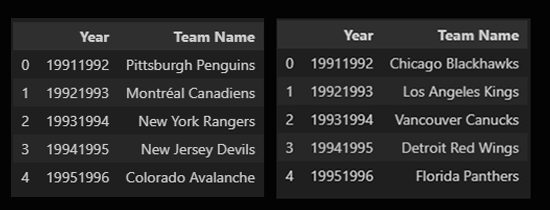
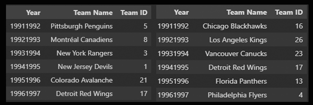
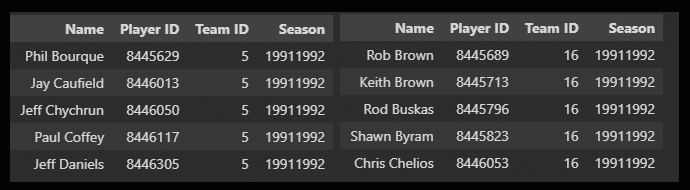
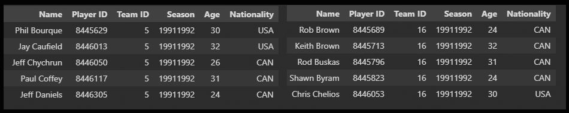

# project-sports-analytics-NHL
_(The NHL and the NHL Shield are registered trademarks of the National Hockey League. NHL and NHL team marks are the property of the NHL and its teams. © NHL 2023. All Rights Reserved.)_

## Overview
This project contains statistical information regarding the Stanley Cup winning teams and the corresponding losing teams from 1991-1992 to the 2021-2022 season. The purpose of this project is to analyze the age and nationality distributions of players on these teams and examine any significant differences between the winners and losers and if there are any statistical significant difference between the team.

Note: The 2004-2005 season was player work stopage and therefore the National Hockey League (NHL) suspended the season.  Only 29 Stanley Cup seasons were analysed

## Table of Contents

- [Background](#background)
- [Data Collection](#data-collection)
- [Analysis](#analysis)
- [Results](#results)
- [Future Work](#future-work)
- [Conclusion](#conclusion) 
- [Team Members](#team-members)


## Background
The Stanley Cup is the hardest ttophy to win in all professional sports, awarded annually to the team that emerges victorious in the National Hockey League (NHL) playoffs.  The winning team must win 16 games in order to win "The Cup". Understanding the composition of winning and losing teams can provide valuable insights into the dynamics and strategies that contribute to success on the ice.

## Data Collection
The data used for this analysis was collected from the Nation Hockey Leagues free Application Programing Interface (API) which included official NHL records and statistics for each season, team and player. It includes information such as player names, ages, nationalities, and team affiliations for each season.  As well as all the statistical inforamtion for each player.  In order to harvest the information needed, the first task was to get a list of all Stanley Cup winners and losers for the past 30 years (1991-2022).  To obtain this information, a scrap of:
```
url = "https://en.wikipedia.org/wiki/List_of_Stanley_Cup_champions"
```

>_stanleycup_winner_cleaned_df.head()/stanleycup_losing_cleaned_df.head()_
>
>

Due to the format of the "season" needed as a parameter used by the NHL API, the dates were formated from '1991' to 19911992' 

Once the winning and loosing teams were identified from the awarded 29 Stanley Cup from 1991-2022, the following NHL API's were used

```
Teams Information
GET https://statsapi.web.nhl.com/api/v1/teams

Returns a list of data about all teams including their ID's, venue details, division, conference and franchise information.
```

The Team ID's were used to construct two (2) dataframes to associate the Team ID with the Winning teams and losing teams

>_stanleycup_winning_merge_byname_ID.head()/stanleycup_losing_merge_byname_ID.head()_
>
>

Using the Team ID's and the seasons, the winning and losing dataframes could be expanded to include the rosters and player ID 
```
Team Roster
GET https://statsapi.web.nhl.com/api/v1/team/<ID>?expand=team.roster&season=<seasom>

Returns the roster for the specified season
```
>_winning_df.head()/losing_df.head()_
>
>


The player ID was used to get the player characteristics using the player ID and appended to the winning and losing dataframes 
```
Player Details and Characteristics
GET https://statsapi.web.nhl.com/api/v1/people/<ID>

Returns details for a player, such as birth year and Nationality. 

The birthyear was used to extrapolate the age of the player the season the player won/lost the Stanley Cup
```
>_winning_df.head()/losing_df.head()_
>
>

New dataframes were created for both the winning and losing Stanley Cup to hold the average age per season of the team(s).  

>avg_player_age_winning_df.head()/avg_player_age_losing_df
>
>

Nationalities of the Stanley Cup Winning Team in 1991 and 2022 dataframes were generated in order to evaluate a trend in the nationality make-up of the teams.


Statistics of the player was then compiled and appended to the winning and loosing dataframes

```
Player Statistics
GET https://statsapi.web.nhl.com/api/v1/people/<ID>/stats?stats=statsSingleSeason&season=<SEASON>

Returns all statistics for that player from specified season
```


## Analysis
The main focus of this project is to compare the age and nationality distributions of players on the winning and losing teams. By examining these variables, we can gain a deeper understanding of the factors that may contribute to a team's success or failure in the pursuit of the Stanley Cup.

## Results
The results of the analysis will be presented in the form of visualizations and statistical summaries. We will explore trends and patterns in the age and nationality distributions of players, highlighting any noteworthy differences between the winning and losing teams.

## Future Work
This project is an ongoing effort, and future updates may include additional seasons, more in-depth analysis, and comparative studies with other championships. We welcome contributions and suggestions from the community to further enhance this repository.

## Conclusion
By examining the age and nationality distributions of players on Stanley Cup-winning and losing teams since 1991, this project aims to provide insights into the factors that contribute to success in ice hockey. The findings of this analysis may be valuable for coaches, players, and fans alike, as they shed light on the characteristics of championship teams.

## Team Members
Joel Demontigny, Ravina Kolsawala, Ron Brennan
