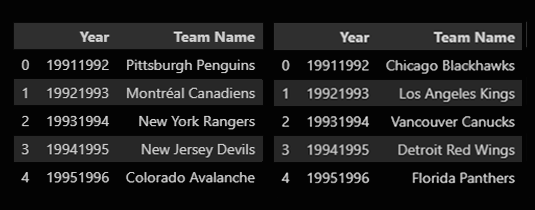
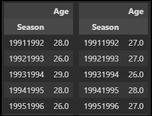
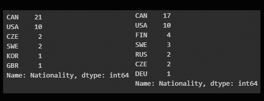
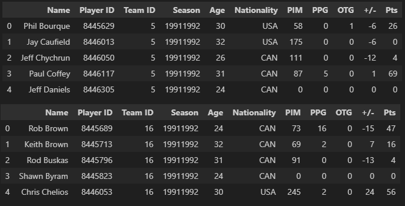

# project-sports-analytics-NHL
_(The NHL and the NHL Shield are registered trademarks of the National Hockey League. NHL and NHL team marks are the property of the NHL and its teams. © NHL 2023. All Rights Reserved.)_

## Overview
This project contains statistical information regarding the Stanley Cup winning teams and the corresponding losing teams from 1991-1992 to the 2021-2022 season. The purpose of this project is to analyze the age and nationality distributions of players on these teams and examine any significant differences between the winners and losers and if there are any statistical significant difference between the team.

Note: The 2004-2005 season was player work stopage and therefore the National Hockey League (NHL) suspended the season.  Only 29 Stanley Cup seasons were analysed

## Table of Contents

- [Background](#background)
- [Limitations](#limitations)
- [Data Collection](#data-collection)
- [Analysis](#analysis)
- [Conclusion](#conclusion) 
- [Future Work](#future-work)
- [Team Members](#team-members)


## Background
The Stanley Cup is the hardest ttophy to win in all professional sports, awarded annually to the team that emerges victorious in the National Hockey League (NHL) playoffs.  The winning team must win 16 games in order to win "The Cup". Understanding the composition of winning and losing teams can provide valuable insights into the dynamics and strategies that contribute to success on the ice.

## Limitations
A few limitations were identified from the beginning of this project.
- This is our fist project in Datavisualization, therefore the experience level for the team was low
- Free APIs were used as there was not a budget to purchase additional APIs
- The NHL APIs were missing data for the 1990-1991 Minnesota North Stars as the data was not kept when the team was reloacted to Dallas.  Therefore the 1990 - 1991 season was removed leave only 29 seasons of awarded Stanley Cups as the 2004 - 2005 season was cancelled due to the NHL labour dispute.  


## Data Collection
The data used for this analysis was collected from the Nation Hockey Leagues free Application Programing Interface (API) which included official NHL records and statistics for each season, team and player. It includes information such as player names, ages, nationalities, and team affiliations for each season.  As well as all the statistical information for each player.  In order to harvest the information needed, the first task was to get a list of all Stanley Cup winners and losers for the past 30 years (1991-2022).  To obtain this information, a scrap of:
```
url = "https://en.wikipedia.org/wiki/List_of_Stanley_Cup_champions"
```

>_stanleycup_winner_cleaned_df.head()/stanleycup_losing_cleaned_df.head()_
>
>

Due to the format of the "season" needed as a parameter used by the NHL API, the dates were formated from '1991' to 19911992' 

Once the winning and loosing teams were identified from the awarded 29 Stanley Cup from 1991-2022, the following NHL API's were used

```
Teams Information
GET https://statsapi.web.nhl.com/api/v1/teams

Returns a list of data about all teams including their ID's, venue details, division, conference and franchise information.
```

The Team ID's were used to construct two (2) dataframes to associate the Team ID with the Winning teams and losing teams

>_stanleycup_winning_merge_byname_ID.head()/stanleycup_losing_merge_byname_ID.head()_
>
>

Using the Team ID's and the seasons, the winning and losing dataframes could be expanded to include the rosters and player ID 
```
Team Roster
GET https://statsapi.web.nhl.com/api/v1/team/<ID>?expand=team.roster&season=<seasom>

Returns the roster for the specified season
```
>_winning_df.head()/losing_df.head()_
>
>


The player ID was used to get the player characteristics using the player ID and appended to the winning and losing dataframes 
```
Player Details and Characteristics
GET https://statsapi.web.nhl.com/api/v1/people/<ID>

Returns details for a player, such as birth year and Nationality. 

The birthyear was used to extrapolate the age of the player the season the player won/lost the Stanley Cup
```
>_winning_df.head()/losing_df.head()_
>
>

New dataframes were created for both the winning and losing Stanley Cup to hold the average age per season of the team(s).  

>avg_player_age_winning_df.head()/avg_player_age_losing_df
>
>

Nationalities of the Stanley Cup Winning Team in 1991 and 2022 dataframes were generated in order to evaluate a trend in the nationality make-up of the teams in the 30 year span.

>player_nat_1992.value_counts()/player_nat_2022.value_counts()
>
>

Statistics of all the players were then compiled and appended to the winning and loosing dataframes

```
Player Statistics
GET https://statsapi.web.nhl.com/api/v1/people/<ID>/stats?stats=statsSingleSeason&season=<SEASON>

Returns all statistics for that player from specified season
```

The stats that were comilied for bothe winning and losing teams were:
- Penalty Minutes (PIM)
- PowerPlay Goals (PPG)
- Over Time Winning Gola (OTG)
- Plus/Minus (+/-)
- Point (Pts)

>winning_df.head()/losing_df.head()
>
>

## Analysis
The main focus of this project is to compare the nationality distributions and play statistics of players on the winning and losing teams. By examining these variables, we can gain a deeper understanding of the factors that may contribute to a team's success or failure in the pursuit of the Stanley Cup.  Our analysis is as follows:
- There is a noticeable increase in European players when comparing the most recent winning team's roster vs that of 1991-1992. Canadian representation has had a significant reduction, and the U.S. remains constant, but most recently had the lowest representation.
- The Canadian player reduction in representation was most significant impacted in the decade of 2003-2012 and has remained consistent since.
- The correlation between PPG vs Pts is 0.83. This graph clearly depicts the correlation between scoring PPG and resulting in an overall increase in points.
- The correlation between PIM and +/- is 0.16. Except for outliers, the lower a player's PIM, the more likely of a more positive +/- result.
- Of the 2000+ entries, +2 to -2 is very dense. The winning team (blue) has a slightly above 0 stronger representation with an average +/- of slightly above 4 and the losing team at 2. When compare the two sets of values, the p-value supports that there is a very strong correlation between a more positive +/- and winning. 
- The results of the box plots depicts how the winning team has far more consistency amongst its players. This is also supported by having less outliers than the losing team at each extremity.
- When comparing the identified key stats for the season between the winning and losing team, it is apparent that the one stat with the most material difference and impact is the '+/-'.

## Conclusion
This project aims to provide insights into the factors that contribute to success in hockey. The findings of this analysis may be valuable for coaches, players, and fans alike, as they shed light on the characteristics of championship teams.  These characteristics may be consider the makeup of a Stanley Cup winning team:  
- Based on our overall analysis and supporting data, there is no material difference regarding age groups and winning.  Years of experience requires additional analysis.
- There should be a heightened focus on recruiting European players.   Their hockey programs have significantly evolved, and the number of European players playing in the NHL is showing a steady increase, while the Canadian player representation is reducing.
- It is favorable and improves the likelihood of winning to have more consistent contributing players vs having one or two superstars on the team.  The box plot comparing the +/- for the winning and losing teams, supports this theory as the winning team has less outliers than that of the losing team.  The +/- statistic is also the only key statistic analyzed that has a material difference in results when comparing the winning and losing team.

## Future Work
This project is an ongoing effort, and future updates may include additional seasons, and more in-depth analysis on suplimentary statistics. We welcome contributions and suggestions from the community to further enhance this repository.  We have outlined areas of work that are most important:
- Age was used and not the years of expereince. Years of expereince is a valuable metric and should be added. 
- Game-by-Game analysis should provide more gandular analysis.
- Nationality counts per team per season dropped considerably in 2012 and began to increase season following. Analysis of this is required

## Team Members
Joel Demontigny, Ravina Kolsawala, Ron Brennan
